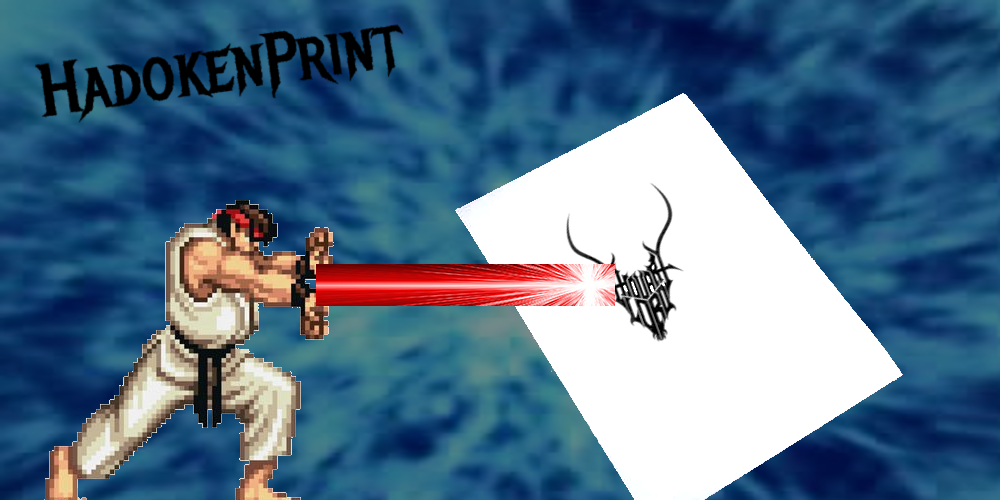

# Hadoken print 

# Global description
This repo is where the code for our engineering science class school project.
The goal of the project is to make a laser graver machine that prints images on paper.

# Technical description
The project is divided in 2 parts:
- The arduino part (located in the `arduino` folder), is the code that is flashed on the motor controllers and will take inputs from serial communication to make the motors move, it also contains to code to control the laser.
- The python part, is handling the image processing and sending the data to the arduino motors, and the laser.

# Hardware
We are using 2 [µStepper motors](https://www.ustepper.com/what-is-ustepper/) to move the laser on the X and Y axis, and a laser diode to burn the paper.
We made the whole structure ourselves with 3D printed parts and aluminium profiles.
